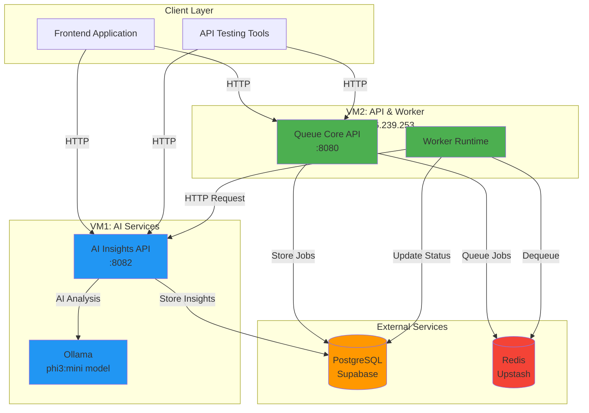
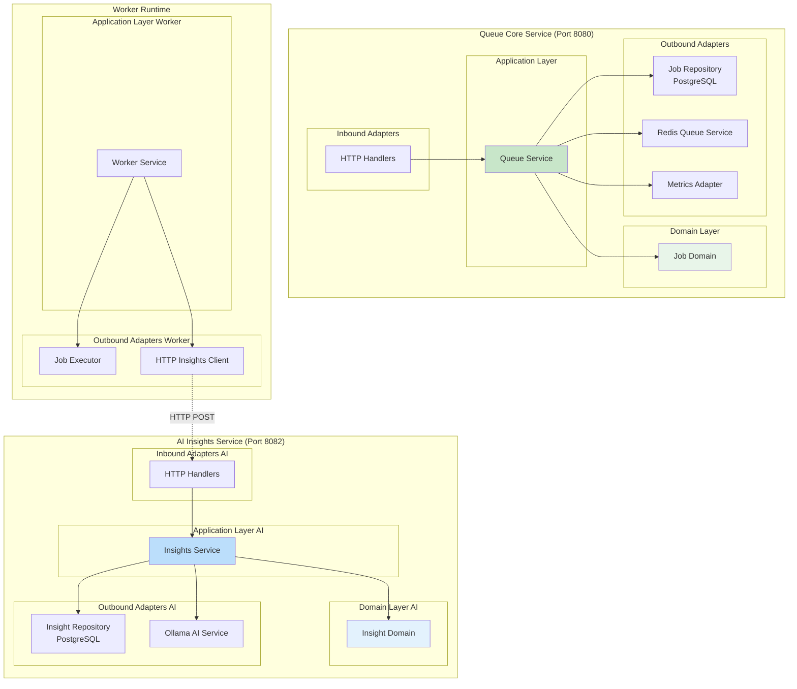
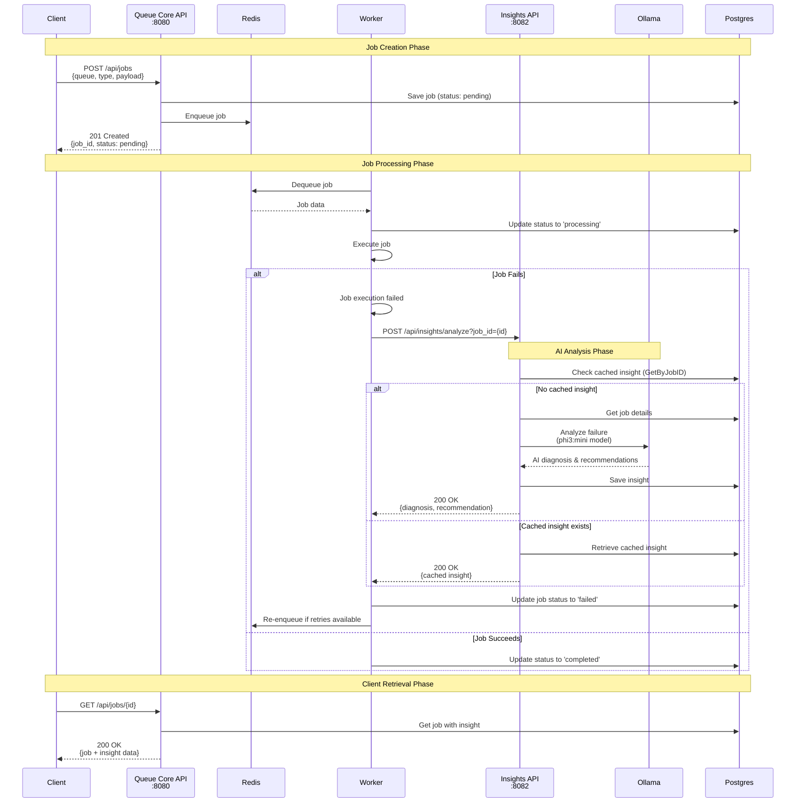
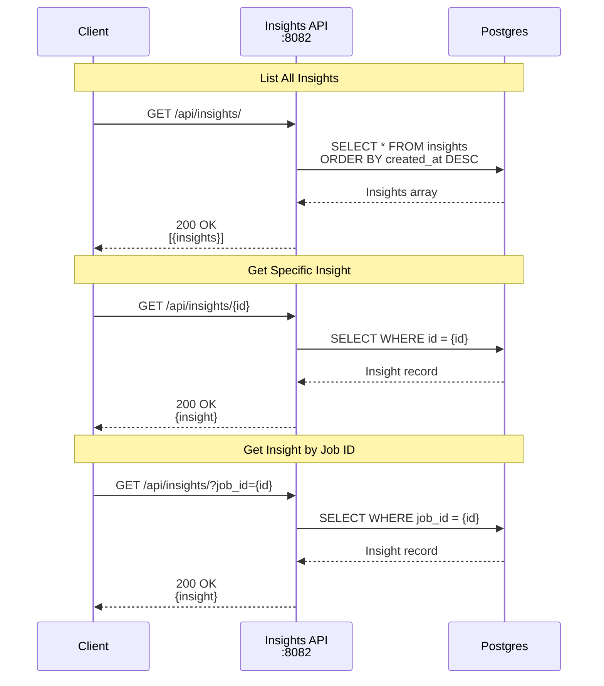
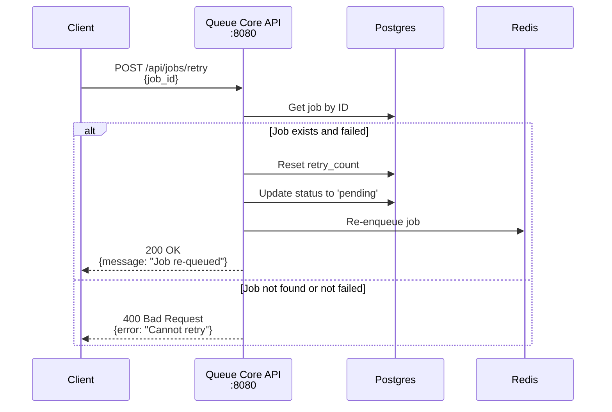
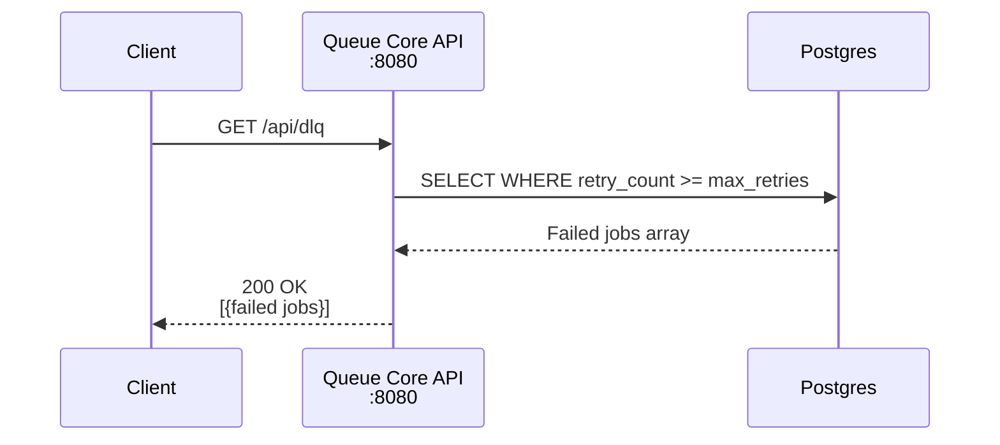

# AI Smart Queue - API Documentation

## Table of Contents
1. [System Architecture](#system-architecture)
2. [Component Block Diagram](#component-block-diagram)
3. [API Sequence Flows](#api-sequence-flows)
4. [Endpoint Reference](#endpoint-reference)

---

## System Architecture

### High-Level Architecture Diagram



---

## Component Block Diagram

### Hexagonal Architecture



---

## API Sequence Flows

### 1. Complete Job Lifecycle with AI Analysis



### 2. Insights Query Flow



### 3. Job Retry Flow



### 4. Dead Letter Queue Flow



---

## Endpoint Reference

### Base URLs

| Environment | Service | URL |
|------------|---------|-----|
| **Production** | Queue Core | `http://163.176.239.253:8080` |
| **Production** | AI Insights | `http://163.176.243.66:8082` |
| **Development** | Queue Core | `http://localhost:8080` |
| **Development** | AI Insights | `http://localhost:8082` |

### Queue Core API (Port 8080)

| Method | Endpoint | Description |
|--------|----------|-------------|
| POST | `/api/jobs` | Create a new job |
| GET | `/api/jobs` | List jobs (with filters) |
| GET | `/api/jobs/{id}` | Get job by ID |
| POST | `/api/jobs/retry` | Retry a failed job |
| GET | `/api/dlq` | Get dead letter queue jobs |
| GET | `/api/metrics` | Get system metrics |
| GET | `/health` | Health check |

### AI Insights API (Port 8082)

| Method | Endpoint | Description |
|--------|----------|-------------|
| GET | `/api/insights/` | List all insights |
| GET | `/api/insights/{id}` | Get insight by ID |
| GET | `/api/insights/?job_id={id}` | Get insight by job ID |
| POST | `/api/insights/analyze` | Trigger AI analysis for a job |
| GET | `/health` | Health check |

### Example Requests

#### Create Job
```bash
curl -X POST http://163.176.239.253:8080/api/jobs \
  -H "Content-Type: application/json" \
  -d '{
    "queue": "default",
    "type": "send-email",
    "payload": {"to": "user@example.com", "subject": "Hello"}
  }'
```

#### Get Job with Insights
```bash
curl http://163.176.239.253:8080/api/jobs/{job_id}
```

#### List Insights
```bash
curl http://163.176.243.66:8082/api/insights/
```

#### Trigger AI Analysis
```bash
curl -X POST "http://163.176.243.66:8082/api/insights/analyze?job_id={job_id}"
```

### Response Codes

| Code | Description |
|------|-------------|
| 200 | Success |
| 201 | Created |
| 400 | Bad Request (invalid input) |
| 404 | Not Found |
| 500 | Internal Server Error |

### Key Features

- **AI-Powered Analysis**: phi3:mini model (2.3GB, ~2-3 min analysis time)
- **Caching**: Prevents redundant AI analysis via GetByJobID check
- **Retry Logic**: Automatic retry with exponential backoff
- **Cross-VM Communication**: HTTP-based insights (5-min timeout)
- **Dead Letter Queue**: Failed jobs after max retries

### Performance Metrics

- **AI Analysis Time**: 48s - 2m50s (phi3:mini)
- **Model Size**: 2.3GB (96% smaller load than Mistral)
- **Timeout**: 5 minutes for AI analysis
- **Max Retries**: 3 attempts per job

---

## Converting to PDF

To convert this document to PDF:

### Option 1: VS Code Extension
1. Install "Markdown PDF" extension
2. Open this file
3. Press `Ctrl+Shift+P`
4. Type "Markdown PDF: Export (pdf)"

### Option 2: Pandoc
```bash
pandoc API_DOCUMENTATION.md -o API_DOCUMENTATION.pdf --pdf-engine=xelatex
```

### Option 3: GitHub
- View this file on GitHub
- Use browser "Print to PDF" feature

---

**Last Updated**: January 2, 2026
**API Version**: 1.0.0
