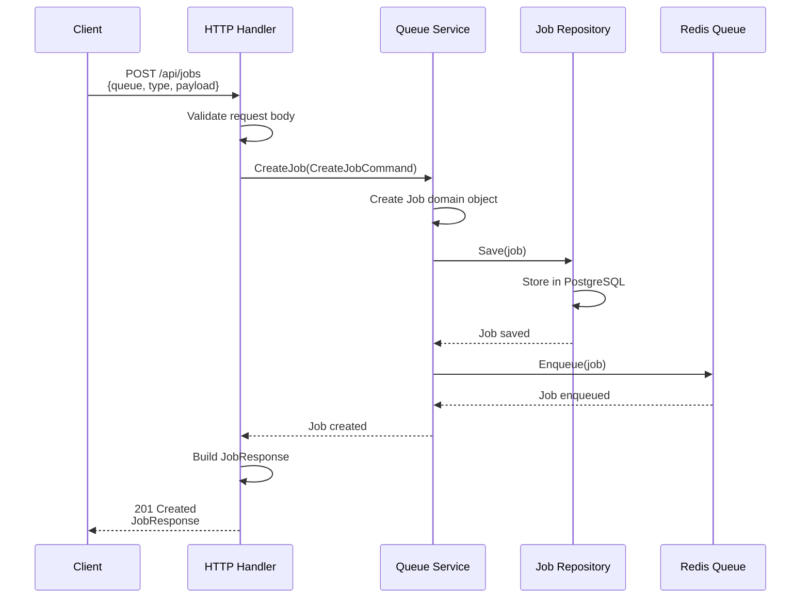
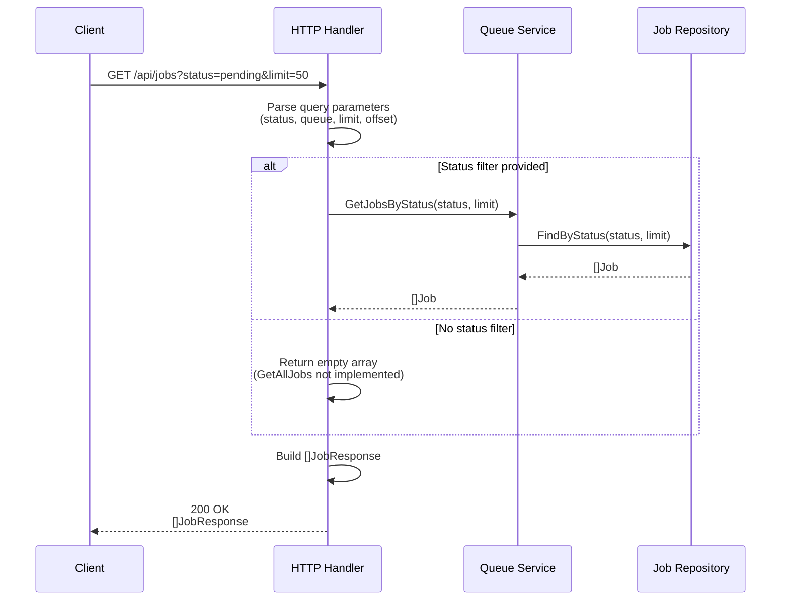
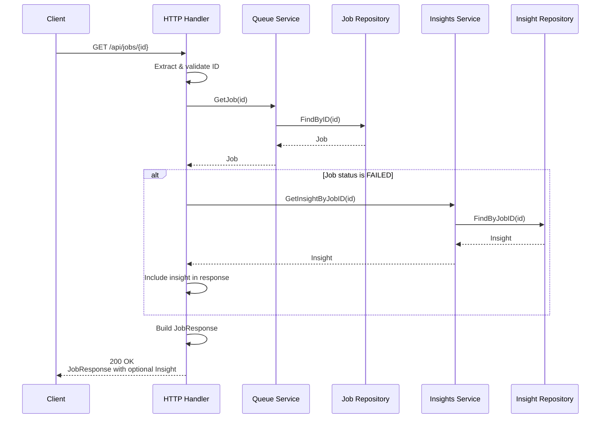
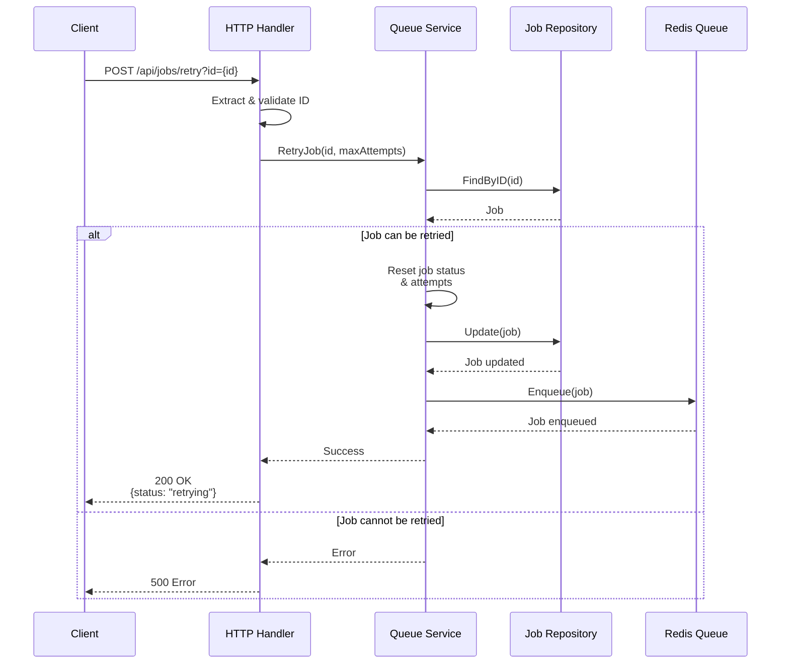
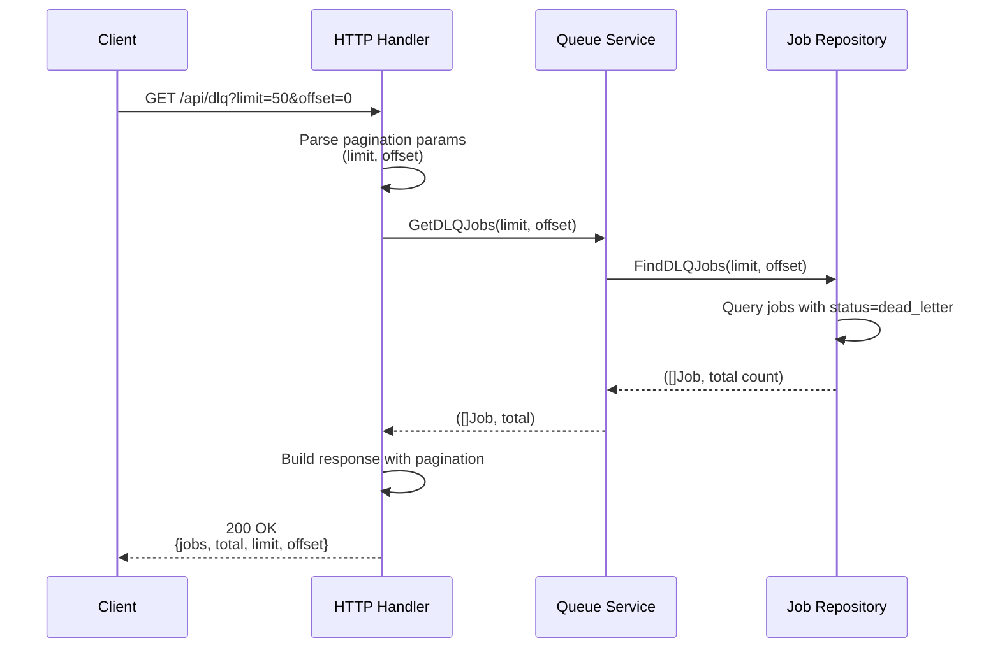
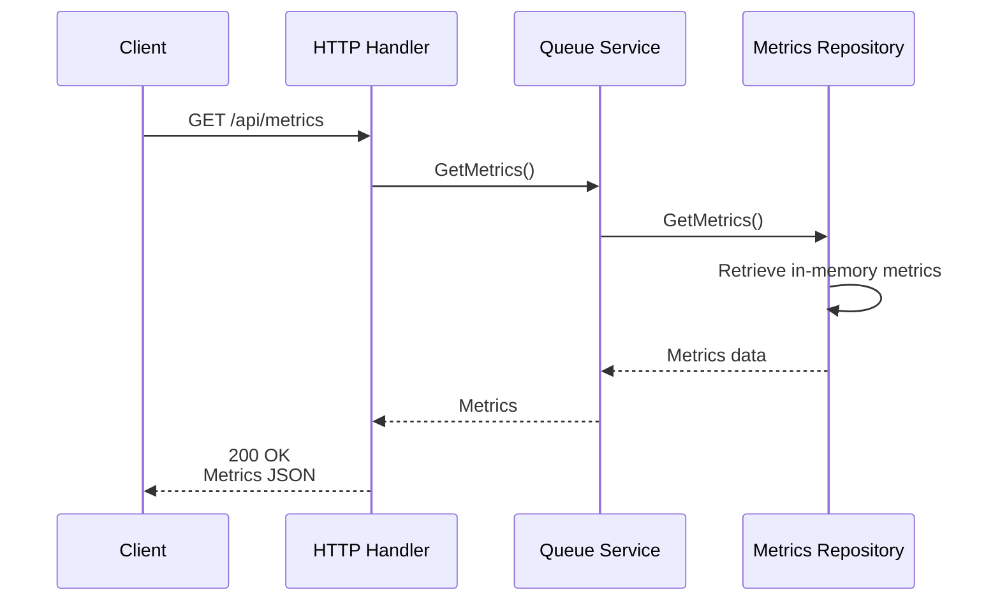
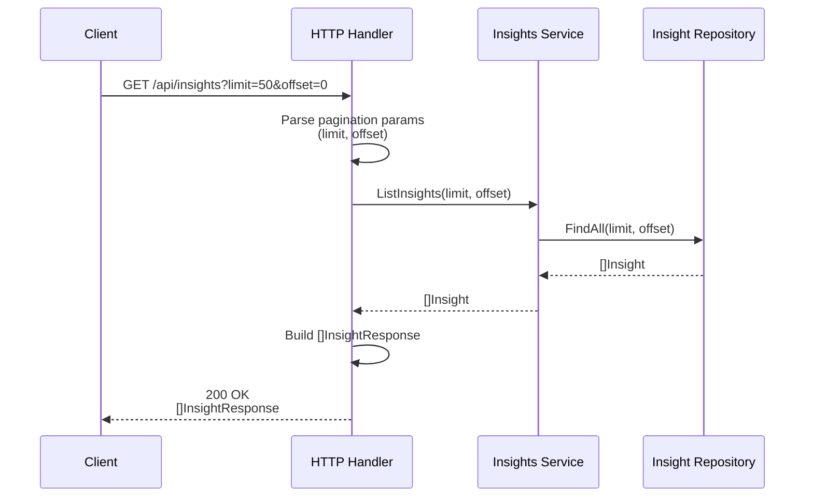
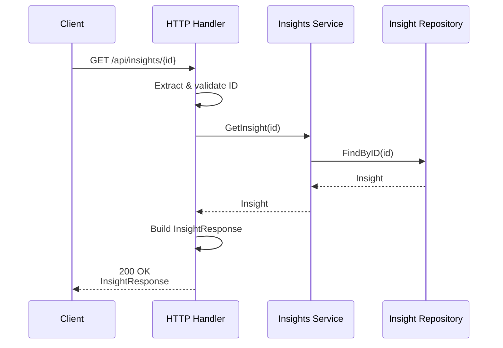
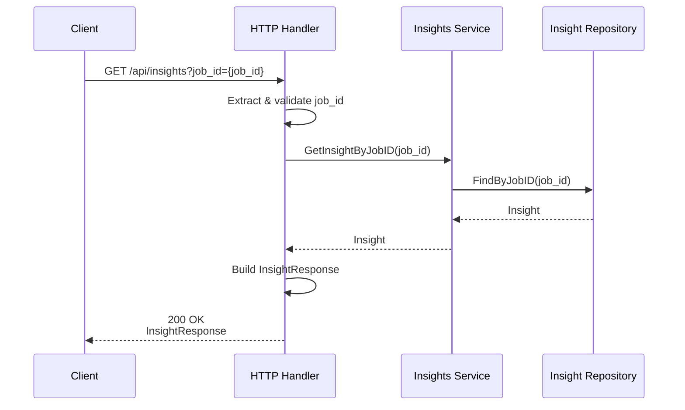
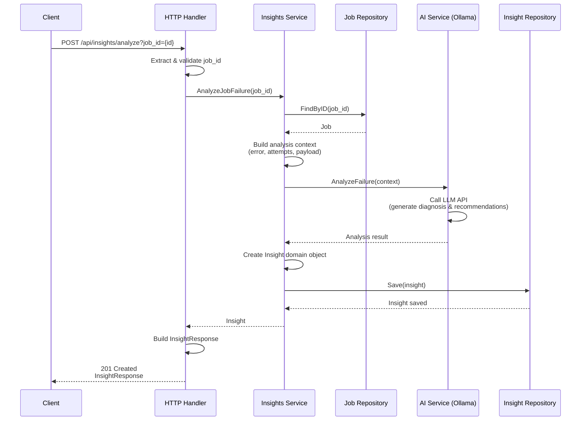

# API Sequence Diagrams

This document contains sequence diagrams for all API endpoints in the AI Smart Queue system.

## Table of Contents
1. [Queue Endpoints](#queue-endpoints)
   - [POST /api/jobs - Create Job](#post-apijobs---create-job)
   - [GET /api/jobs - List Jobs](#get-apijobs---list-jobs)
   - [GET /api/jobs/{id} - Get Job by ID](#get-apijobsid---get-job-by-id)
   - [POST /api/jobs/retry - Retry Job](#post-apijobsretry---retry-job)
   - [GET /api/dlq - Get Dead Letter Queue Jobs](#get-apidlq---get-dead-letter-queue-jobs)
   - [GET /api/metrics - Get Metrics](#get-apimetrics---get-metrics)
2. [Insights Endpoints](#insights-endpoints)
   - [GET /api/insights - List Insights](#get-apiinsights---list-insights)
   - [GET /api/insights/{id} - Get Insight by ID](#get-apiinsightsid---get-insight-by-id)
   - [GET /api/insights?job_id={id} - Get Insight by Job ID](#get-apiinsightsjob_idid---get-insight-by-job-id)
   - [POST /api/insights/analyze - Analyze Job](#post-apiinsightsanalyze---analyze-job)

---

## Queue Endpoints

### POST /api/jobs - Create Job

Creates a new job in the queue system.



**Request:**
```json
{
  "queue": "email-queue",
  "type": "send-email",
  "payload": {...}
}
```

**Response:**
```json
{
  "id": "uuid",
  "queue": "email-queue",
  "type": "send-email",
  "status": "pending",
  "attempts": 0,
  "payload": {...},
  "created_at": "2024-01-01T00:00:00Z",
  "updated_at": "2024-01-01T00:00:00Z"
}
```

---

### GET /api/jobs - List Jobs

Lists jobs with optional filtering by status and queue.



**Response:**
```json
[
  {
    "id": "uuid",
    "queue": "email-queue",
    "type": "send-email",
    "status": "pending",
    "attempts": 0,
    "payload": {...},
    "created_at": "2024-01-01T00:00:00Z",
    "updated_at": "2024-01-01T00:00:00Z"
  }
]
```

---

### GET /api/jobs/{id} - Get Job by ID

Retrieves a specific job by its ID, including insights if the job has failed.



**Response (with insight):**
```json
{
  "id": "uuid",
  "queue": "email-queue",
  "type": "send-email",
  "status": "failed",
  "attempts": 3,
  "payload": {...},
  "error": "Connection timeout",
  "insight": {
    "id": "insight-uuid",
    "job_id": "uuid",
    "diagnosis": "...",
    "recommendation": "...",
    "suggested_fix": {...}
  },
  "created_at": "2024-01-01T00:00:00Z",
  "updated_at": "2024-01-01T00:00:00Z"
}
```

---

### POST /api/jobs/retry - Retry Job

Retries a failed or dead-lettered job.



**Response:**
```json
{
  "status": "retrying"
}
```

---

### GET /api/dlq - Get Dead Letter Queue Jobs

Retrieves jobs from the dead letter queue with pagination.



**Response:**
```json
{
  "jobs": [
    {
      "id": "uuid",
      "queue": "email-queue",
      "status": "dead_letter",
      "attempts": 3,
      "error": "Max retries exceeded",
      ...
    }
  ],
  "total": 42,
  "limit": 50,
  "offset": 0
}
```

---

### GET /api/metrics - Get Metrics

Retrieves queue metrics and statistics.



**Response:**
```json
{
  "total_jobs": 1000,
  "pending_jobs": 50,
  "processing_jobs": 10,
  "completed_jobs": 920,
  "failed_jobs": 15,
  "dead_letter_jobs": 5,
  "average_processing_time": 1250,
  "success_rate": 0.92
}
```

---

## Insights Endpoints

### GET /api/insights - List Insights

Lists all insights with pagination.



**Response:**
```json
[
  {
    "id": "uuid",
    "job_id": "job-uuid",
    "diagnosis": "Connection timeout after 30 seconds",
    "recommendation": "Increase timeout to 60 seconds",
    "suggested_fix": {
      "timeout_seconds": 60,
      "max_retries": 5,
      "payload_patch": {...}
    },
    "created_at": "2024-01-01T00:00:00Z"
  }
]
```

---

### GET /api/insights/{id} - Get Insight by ID

Retrieves a specific insight by its ID.



**Response:**
```json
{
  "id": "uuid",
  "job_id": "job-uuid",
  "diagnosis": "Connection timeout after 30 seconds",
  "recommendation": "Increase timeout to 60 seconds",
  "suggested_fix": {
    "timeout_seconds": 60,
    "max_retries": 5,
    "payload_patch": {...}
  },
  "created_at": "2024-01-01T00:00:00Z"
}
```

---

### GET /api/insights?job_id={id} - Get Insight by Job ID

Retrieves the insight associated with a specific job.



**Response:** Same as Get Insight by ID

---

### POST /api/insights/analyze - Analyze Job

Triggers AI analysis of a failed job to generate insights.



**Response:**
```json
{
  "id": "uuid",
  "job_id": "job-uuid",
  "diagnosis": "Connection timeout after 30 seconds. The external API at https://api.example.com is experiencing high latency.",
  "recommendation": "Increase the timeout configuration to 60 seconds and implement exponential backoff for retries.",
  "suggested_fix": {
    "timeout_seconds": 60,
    "max_retries": 5,
    "payload_patch": {
      "retry_strategy": "exponential_backoff",
      "initial_delay_ms": 1000
    }
  },
  "created_at": "2024-01-01T00:00:00Z"
}
```

---

## Architecture Notes

All endpoints follow the **Hexagonal Architecture** pattern:

1. **HTTP Handlers** (Inbound Adapter) - Handle HTTP requests/responses
2. **Application Services** - Orchestrate business logic
3. **Domain Layer** - Core business entities and rules
4. **Repositories** (Outbound Adapter) - Data persistence
5. **External Services** (Outbound Adapter) - AI, Redis, etc.

The flow is always:
```
Client → HTTP Handler → Application Service → Domain Logic → Repository/External Service
```
