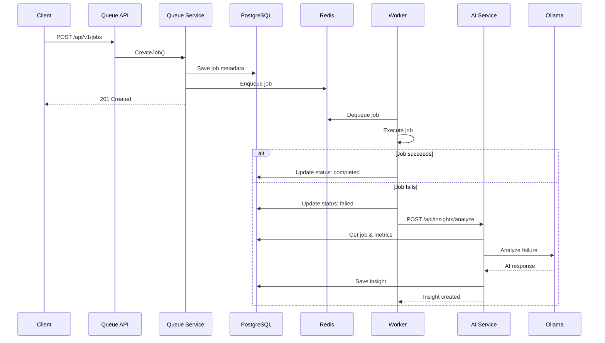

# AI‑Enhanced Distributed Job Queue (Go)

An AI‑powered distributed job queue written in Go, with worker pools, retries,
dead‑letter queues, and intelligent insights for failures and scaling.

This project combines **distributed systems** and **AI** to create a **smart**
job queue that not only runs background jobs reliably, but also learns from
its own behavior.

---

## ✨ Features

- **Distributed job queue** with named queues (e.g., `high`, `default`, `low`)
- **Worker pools** with concurrent execution
- **Retries** with exponential backoff
- **Dead‑Letter Queue (DLQ)** for permanently failed jobs
- **Job scheduling** for delayed jobs (run later) and periodic jobs (cron‑like)
- **AI insights** for:
  - Failure analysis (why jobs failed)
  - Suggested actions (retry, skip, alert)
  - ETA predictions (when a job will likely finish)
  - Scaling recommendations (how many workers to run)
- **Postgres** (Supabase) for job metadata and AI insights
- **Redis** (Upstash) as the queue backend
- **Ollama** with **phi3:mini** model (2.3GB, ARM-optimized, ~2-3 min analysis time)
- **HTTP-based microservices** for distributed deployment across VMs
- **Prometheus + Grafana** for metrics and monitoring (optional)

---

## 📚 API Documentation

**Interactive Documentation:**
- **[Swagger UI](../../blob/main/swagger.yaml)** - OpenAPI specification
- **[API Documentation](API_DOCUMENTATION.md)** - Complete guide with contracts
- **[Sequence Diagrams](API_SEQUENCE_DIAGRAMS.md)** - All endpoint flows
- **[Architecture Details](HEXAGONAL_ARCHITECTURE.md)** - Design patterns

**Key Endpoints:**

### Queue Core API (Port 8080)
```bash
POST   /api/v1/jobs          # Create new job
GET    /api/v1/jobs/:id      # Get job status
GET    /api/v1/jobs          # List jobs (filter by status/queue)
POST   /api/v1/jobs/retry    # Retry failed job
GET    /api/v1/dlq           # Get dead letter queue
GET    /api/v1/metrics       # Queue metrics
GET    /health               # Health check
```

### AI Insights API (Port 8082)
```bash
POST   /api/insights/analyze # Analyze job failure
GET    /api/insights/:id     # Get insight by ID
GET    /api/insights         # List all insights
GET    /health               # Health check
```

---

## 🚀 Quick Start

### Prerequisites

- Go 1.21+
- Docker & Docker Compose
- Supabase account (for PostgreSQL)
- Upstash account (for Redis)
- Ollama (for AI insights)

### Setup

1. **Clone the repository**
   ```bash
   git clone https://github.com/yourusername/ai-smart-queue.git
   cd ai-smart-queue
   ```

2. **Configure production settings**
   
   ⚠️ **IMPORTANT**: Never commit real credentials to version control!
   
   ```bash
   # Copy the example config
   cp configs/config.prod.yaml.example configs/config.prod.yaml
   
   # Edit config.prod.yaml and add your credentials:
   # - Supabase PostgreSQL DSN
   # - Upstash Redis URL
   # - Your deployment URLs
   ```
   
   **Get your credentials:**
   - **Supabase**: Dashboard → Project Settings → Database → Connection String (Pooler)
   - **Upstash**: Dashboard → Your Database → REST API → REDIS_URL

3. **Run with Docker Compose**
   ```bash
   # Development (local PostgreSQL + Redis)
   docker-compose -f docker-compose.dev.yml up -d
   
   # Production (remote Supabase + Upstash)
   docker-compose -f docker-compose.prod.yml up -d
   ```

4. **Run migrations**
   ```bash
   # Development
   docker-compose -f docker-compose.dev.yml up migrate
   
   # Production - update config.prod.yaml first!
   go run scripts/migrate/main.go
   ```

5. **Test the API**
   ```bash
   # Health check
   curl http://localhost:8080/health
   
   # Enqueue a job
   curl -X POST http://localhost:8080/api/v1/jobs \
     -H "Content-Type: application/json" \
     -d @test-job.json
   
   # Check job status
   curl http://localhost:8080/api/v1/jobs/<job-id>
   
   # View AI insights for failed jobs
   curl http://localhost:8082/api/insights
   ```

### Demo Walkthrough

**1. Create a job:**
```bash
curl -X POST http://localhost:8080/api/v1/jobs \
  -H "Content-Type: application/json" \
  -d '{
    "queue": "email-queue",
    "type": "send-email",
    "payload": {"to": "user@example.com", "subject": "Test"}
  }'
```

**2. Simulate a failure** (with `simulation.enabled: true`):
- The worker will randomly fail jobs based on `failure_rate`
- Failed jobs trigger AI analysis automatically

**3. View AI insights:**
```bash
curl http://localhost:8082/api/insights
```

**Response example:**
```json
{
  "id": "uuid",
  "job_id": "job-uuid",
  "failure_category": "external_dependency",
  "suggested_action": "retry_with_backoff",
  "confidence_score": 0.85,
  "reasoning": "The job failed due to email service timeout...",
  "eta_minutes": 5,
  "scaling_recommendation": "Current worker count (3) is optimal"
}
```

---

- `configs/config.dev.yaml` - Development config (localhost, safe to commit)
- `configs/config.prod.yaml` - **Production config (NEVER COMMIT!)**
- `configs/config.prod.yaml.example` - Template for production config
- `.env.example` - Environment variable reference

**Security Best Practices:**
- Keep `config.prod.yaml` in `.gitignore` (already configured)
- Use environment variables or secret managers for production
- Rotate credentials regularly
- Use read-only database users where possible

---

## 🧱 Architecture Overview

This project implements **Hexagonal Architecture** (Ports and Adapters) for clean separation of concerns and testability.

### System Architecture

```
┌─────────────────────────────────────────────────────────────┐
│                      Primary Adapters                        │
│                  (Driving / Input Side)                      │
│  ┌──────────┐  ┌──────────┐  ┌──────────┐                  │
│  │   HTTP   │  │  Worker  │  │   CLI    │                  │
│  │ Handlers │  │ Runtime  │  │  (future)│                  │
│  └─────┬────┘  └─────┬────┘  └─────┬────┘                  │
│        │             │              │                        │
└────────┼─────────────┼──────────────┼────────────────────────┘
         │             │              │
         v             v              v
┌─────────────────────────────────────────────────────────────┐
│                    Application Layer                         │
│                  (Use Cases / Services)                      │
│  ┌──────────┐  ┌──────────┐  ┌──────────┐                  │
│  │  Queue   │  │ Insights │  │  Worker  │                  │
│  │ Service  │  │ Service  │  │ Service  │                  │
│  └─────┬────┘  └─────┬────┘  └─────┬────┘                  │
│        │             │              │                        │
└────────┼─────────────┼──────────────┼────────────────────────┘
         │             │              │
         v             v              v
┌─────────────────────────────────────────────────────────────┐
│                      Domain Layer                            │
│                  (Business Logic / Entities)                 │
│  ┌──────────┐  ┌──────────┐  ┌──────────┐                  │
│  │   Job    │  │ Insight  │  │  Worker  │                  │
│  │  Entity  │  │  Entity  │  │  Config  │                  │
│  └─────┬────┘  └─────┬────┘  └─────┬────┘                  │
│        │             │              │                        │
│  ┌─────┴─────────────┴──────────────┴────┐                  │
│  │         Ports (Interfaces)             │                  │
│  │  - JobRepository                       │                  │
│  │  - QueueService                        │                  │
│  │  - AIService                           │                  │
│  └────────────────┬───────────────────────┘                  │
└───────────────────┼────────────────────────────────────────┘
                    │
                    v
┌─────────────────────────────────────────────────────────────┐
│                    Secondary Adapters                        │
│                  (Driven / Output Side)                      │
│  ┌──────────┐  ┌──────────┐  ┌──────────┐  ┌──────────┐   │
│  │ Postgres │  │  Redis   │  │  Ollama  │  │ Metrics  │   │
│  │   Repo   │  │  Queue   │  │    AI    │  │ Service  │   │
│  └──────────┘  └──────────┘  └──────────┘  └──────────┘   │
└─────────────────────────────────────────────────────────────┘
```

### API Request Flow



### Core Components

- **queue-core** - Job lifecycle management, REST API, scheduling
- **worker-runtime** - Job execution, retry logic, metrics collection  
- **ai-insights-service** - AI-powered failure analysis using Ollama (phi3:mini)
- **PostgreSQL (Supabase)** - Job metadata and insights storage
- **Redis (Upstash)** - Distributed queue backend

---

## 💡 Technical Highlights

### Architecture Patterns
- ✅ **Hexagonal Architecture** - Clean separation with ports & adapters
- ✅ **Domain-Driven Design** - Rich domain models with business logic
- ✅ **Microservices** - Independently deployable services
- ✅ **Event-Driven** - Redis-based job queue for async processing

### Distributed Systems Features
- 🔄 **Retry Logic** - Exponential backoff with configurable max attempts
- 💀 **Dead Letter Queue** - Permanent failure handling
- 📊 **Metrics Collection** - In-memory metrics with Prometheus support
- 🎯 **Job Scheduling** - Delayed and recurring job support

### AI Integration
- 🤖 **Ollama Integration** - Local LLM (phi3:mini) for cost-effective AI
- 📈 **Failure Analysis** - Automated root cause analysis
- 💡 **Smart Recommendations** - AI-driven scaling and retry suggestions
- ⏱️ **ETA Predictions** - Intelligent job completion estimates

### Cloud & DevOps
- 🐳 **Docker & Docker Compose** - Containerized deployment
- ☁️ **Cloud-Native** - Supabase (PostgreSQL) + Upstash (Redis)
- 🔐 **Security First** - Credentials managed via config templates
- 📚 **Full API Documentation** - OpenAPI/Swagger specification

---

## 📁 Project Structure

```bash
.
├── cmd/
│   ├── queue-core/
│   │   └── main.go
│   ├── worker-runtime/
│   │   └── main.go
│   ├── ai-insights-service/
│   │   └── main.go
│   ├── dashboard-api/
│   │   └── main.go
│   └── scheduler/
│       └── main.go
│
├── internal/
│   ├── queue/
│   │   ├── broker/          # Redis/NATS abstraction
│   │   ├── jobs/            # Job model, CRUD, queries
│   │   ├── retries/         # Retry logic, backoff strategies
│   │   ├── dlq/             # Dead-letter queue handling
│   │   └── scheduler/       # Delayed & recurring jobs
│   ├── workers/             # Worker pool logic, handlers
│   ├── ai/
│   │   ├── failure_analysis/
│   │   └── scaling_predictions/
│   ├── storage/
│   │   ├── postgres/
│   │   └── redis/
│   ├── dashboard/
│   ├── monitoring/          # Prometheus, metrics
│   └── common/              # Config, errors, shared types
│
├── pkg/
│   ├── logger/
│   ├── middleware/
│   └── utils/
│
├── api/
│   ├── rest/
│   │   ├── queue_handlers.go
│   │   ├── insights_handlers.go
│   │   └── routes.go
│   └── grpc/
│
├── deployments/
│   ├── docker/
│   ├── compose/
│   └── k8s/
│
├── configs/
│   └── config.yaml
│
├── scripts/
│   ├── migrate.sh
│   ├── seed.sh
│   └── dev.sh
│
├── docs/
│   ├── architecture.md
│   ├── queue_design.md
│   └── ai_insights.md
│
├── docker-compose.yml
├── Makefile
├── go.mod
└── README.md

---

##  Additional Documentation

- **[Hexagonal Architecture](HEXAGONAL_ARCHITECTURE.md)** - Design patterns and layer details
- **[API Sequence Diagrams](API_SEQUENCE_DIAGRAMS.md)** - Visual flow for all endpoints
- **[Deployment Guide](DEPLOYMENT.md)** - Production deployment instructions
- **[Functional Tests](FUNCTIONAL_TESTS.md)** - Testing strategy and examples
- **[GitHub Actions](GITHUB_ACTIONS.md)** - CI/CD pipeline

---

##  For Interviewers

### Why This Project?

This project demonstrates:

**Backend Engineering:**
- Distributed systems design (queues, workers, retry logic)
- Clean architecture principles (Hexagonal/DDD)
- RESTful API design with OpenAPI documentation
- Database design (PostgreSQL) and caching (Redis)

**Cloud & DevOps:**
- Docker containerization and multi-service orchestration
- Cloud-native deployment (Supabase, Upstash)
- Environment configuration and security best practices

**AI Integration:**
- Practical LLM integration (Ollama)
- Intelligent system monitoring and analysis
- Cost-effective local AI deployment

**Software Craftsmanship:**
- Comprehensive testing (unit, integration, functional)
- Complete documentation (API, architecture, deployment)
- Production-ready code with proper error handling

---

##  Contact

Built by **Erick** as a portfolio demonstration project.

**Tech Stack:** Go  PostgreSQL  Redis  Docker  Ollama  AI/LLM

---

##  License

This project is available for educational and portfolio purposes.
